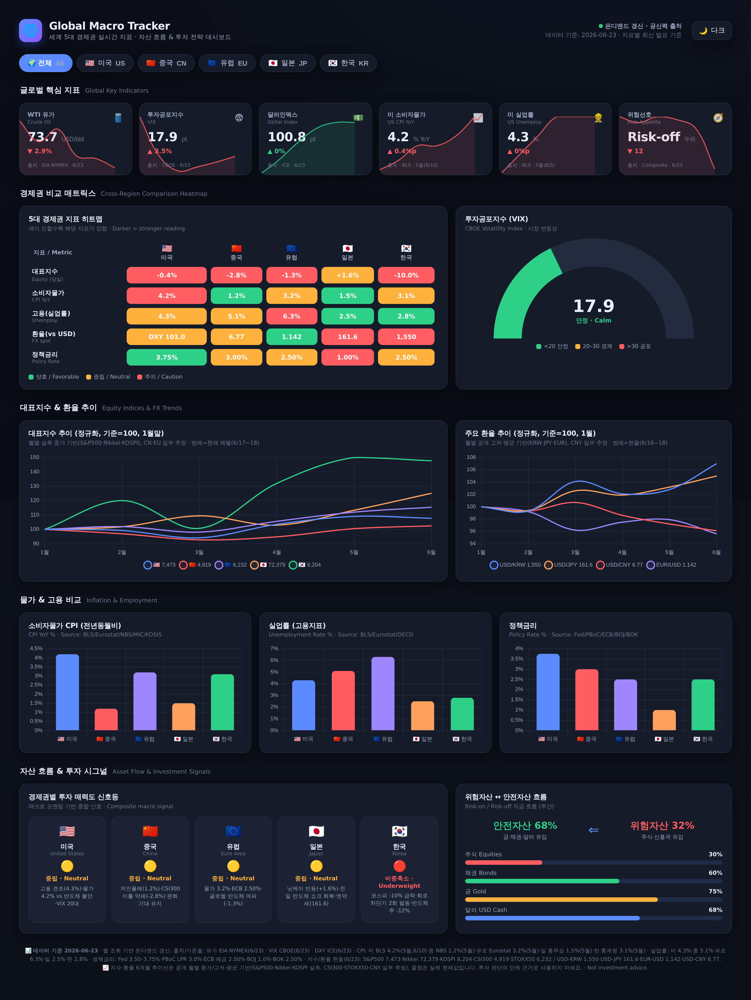
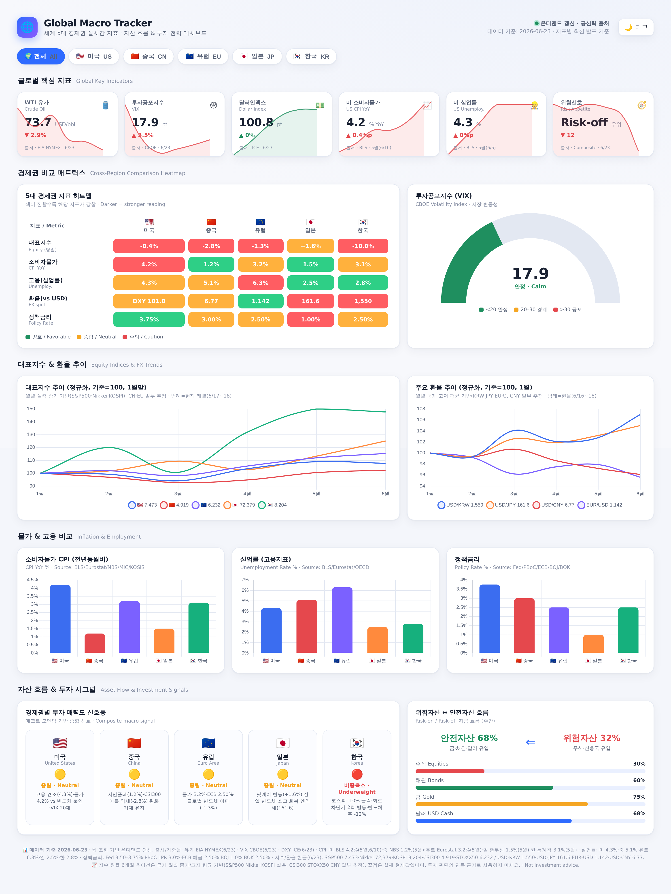

# 🌐 Global Macro Tracker — 세계 경제 대시보드

세계 5대 경제권(**미국 · 중국 · 유럽 · 일본 · 한국**)의 핵심 경제지표와 정세를
한 화면에서 트래킹하여 **자산 흐름 파악과 투자 전략 수립**을 돕는 인터랙티브 대시보드입니다.

🔗 **라이브 대시보드:** https://k-charmander.github.io/econ-dashboard-repo/

> ⚠️ 현재는 **목업(mockup)** 단계로, 공신력 있는 기관의 최근 공개 수치를 참고한
> **현실적 샘플 데이터**를 사용합니다. 실제 투자 판단의 근거로 사용하지 마세요.

## 미리보기 / Preview
| 다크 모드 | 라이트 모드 |
|---|---|
|  |  |

## 저장소 구성
이 저장소에는 **두 개의 대시보드**와 이를 이미지(PNG)로 산출하는 **렌더 도구**가 들어 있습니다.

```
econ-dashboard-repo/
├── index.html               # Global Macro Tracker — 공개 대시보드 (단일 HTML)
├── assets/
│   └── chart.umd.min.js      # Chart.js v4.4.3 로컬 번들 (오프라인 동작용)
├── renders/                 # index.html 렌더 산출물
│   └── mockup-{dark,light}.png
├── scripts/
│   └── render.mjs            # index.html → PNG 렌더 (npm run render)
├── docs/
│   ├── DASHBOARD_STRUCTURE.md # 대시보드 구조·재사용 블루프린트
│   └── REFRESH.md            # 정기 갱신 운영 가이드 (스케줄·런북)
├── package.json             # 렌더 도구 의존성·스크립트
└── .claude/                 # SessionStart 훅 (렌더 도구 자동 준비)
```

> 🔒 이 저장소는 **공개 대시보드 전용**입니다. 과거에 포함돼 있던 개인 자산운용
> 대시보드(`council/`)는 계좌 잔고·보유종목 등 **개인 금융정보**를 담고 있어
> **별도의 비공개(private) 저장소로 분리**되었습니다. (히스토리 포함 이 저장소에서 제거됨)

## 주요 기능 (Global Macro Tracker)
- **글로벌 KPI 카드뷰** — 유가(WTI), 투자공포지수(VIX), 달러인덱스(DXY), 미 CPI, 미 실업률, 위험선호 신호. 각 카드에 미니 스파크라인 + 전기대비 변동 + 출처 표기.
- **경제권 비교 히트맵** — 5개 경제권 × 5개 지표(대표지수·물가·고용·환율·정책금리)를 색상 강도로 표현.
- **시각화 차트 (Chart.js)** — 대표지수 추이(정규화), 환율 추이, CPI 비교, 실업률 비교, 정책금리 비교, VIX 게이지(도넛).
- **투자 시그널 인포그래픽** — 경제권별 투자 매력도 신호등(🟢🟡🔴), 위험자산↔안전자산 자금 흐름.
- **인터랙티브** — 다크/라이트 테마 토글(localStorage 저장), 경제권 필터 탭(전체/US/CN/EU/JP/KR), 차트 호버 툴팁.
- **한국어 + 영문 병기**, 반응형 레이아웃.

## 실행 / 보기
**대시보드를 보는 데는 설치가 필요 없습니다 — `index.html`은 단일 HTML 파일입니다.**

```bash
# 브라우저로 바로 열기
open index.html          # macOS
xdg-open index.html      # Linux

# 또는 로컬 서버 (권장)
python3 -m http.server 8000
# → http://localhost:8000
```

`assets/chart.umd.min.js` 에 Chart.js v4.4.3 을 로컬 번들로 포함해
오프라인/네트워크 제한 환경에서도 동작합니다 (실패 시 CDN 폴백).

## 이미지(PNG) 렌더
대시보드를 다크/라이트 PNG로 산출하는 도구입니다. **이 부분에만 npm 의존성이 필요합니다**
(Playwright + Chromium 등 — 대시보드 *보기*에는 불필요).

```bash
npm install
npx playwright install chromium

npm run render            # index.html → renders/mockup-{dark,light}.png
```

> Claude Code on the web 세션에서는 `.claude/hooks/session-start.sh`(SessionStart 훅)가
> 세션 시작 시 위 도구(npm 의존성 + Chromium)를 자동으로 준비합니다.

## 데이터 출처 (참고 기관)
| 지표 | 출처 |
|---|---|
| 소비자물가 CPI | 미국 BLS · Eurostat · 중국 NBS · 일본 총무성(MIC) · 통계청/KOSIS |
| 고용(실업률) | BLS · Eurostat · OECD |
| 유가 | EIA · NYMEX |
| 대표지수 | 각국 거래소 (S&P500, CSI300, EuroStoxx50, Nikkei225, KOSPI) |
| 투자공포지수 | CBOE (VIX) |
| 환율 | ECB · 한국은행(BOK) · ICE(DXY) |
| 정책금리 | Fed · PBoC · ECB · BOJ · 한국은행 |

데이터 갱신 절차·정기 갱신 스케줄은 [`docs/REFRESH.md`](./docs/REFRESH.md)를 참고하세요.

## 실 API 연동 (추후)
모든 수치는 `index.html` 내 단일 `DATA` 객체에 동일한 스키마로 정의되어 있습니다.
실시간 데이터로 교체하려면 `// TODO(실 API 연동)` 주석 지점에서 아래 소스를 `fetch`해
`DATA` 객체로 매핑하면 됩니다.

- **FRED API** (미국 거시지표 — CPI/실업률/금리)
- **Yahoo Finance / 거래소 API** (지수·환율 시세)
- **EIA API** (에너지/유가)
- **CBOE** (VIX)
- **한국은행 ECOS · KOSIS OpenAPI** (한국 지표)

## 기술 스택
- **대시보드(`index.html`)** — 단일 HTML + 바닐라 JS, [Chart.js](https://www.chartjs.org/) v4.4.3(로컬 번들), CSS 변수 기반 다크/라이트 테마
- **렌더 도구(`scripts/`)** — [Playwright](https://playwright.dev/)(헤드리스 Chromium)

## 더 읽기
- [`docs/DASHBOARD_STRUCTURE.md`](./docs/DASHBOARD_STRUCTURE.md) — 대시보드 구조·재사용 블루프린트
- [`docs/REFRESH.md`](./docs/REFRESH.md) — 정기 갱신 운영 가이드(스케줄·런북)
